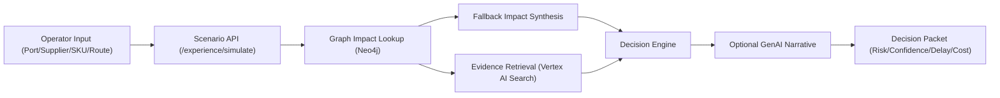

# NervaFlow Intelligence Platform


NervaFlow is a supply-risk decision product built for operations teams that need clarity under disruption.

Instead of a noisy dashboard, it gives one high-confidence decision packet with impact context, quantified risk, and recommended action.

## Why this exists

Supply incidents are rarely blocked by lack of data. They are blocked by slow decision synthesis across ports, suppliers, SKUs, routes, and external signals.

NervaFlow compresses that synthesis into a single operator flow:

1. define scope,
2. run scenario,
3. act on an evidence-backed recommendation.

## At A Glance

| Area | What to inspect |
|---|---|
| Operator experience | The public web flow and `/experience/simulate/` API return one decision packet instead of a dashboard full of disconnected metrics. |
| Evidence layer | Vertex AI Search, fallback impact synthesis, and optional GenAI narrative refinement combine retrieved context with deterministic scoring. |
| Data backbone | GDELT ingest, Discovery import, SQL observability, and billing-aware guardrails support the decision pipeline. |
| Verification | Core Django tests, live endpoint health checks, and repository metrics are listed in the quantified results section. |

## Product direction

- Old identity: `AetherChain` (engineering project name)
- Product identity now: `NervaFlow Intelligence Platform`
- Experience goal: calm, decision-first, operator-grade workflow

## Interface preview


## Demo video

<video src="artifacts/video/nervaflow_demo_linkedin_1080p.mp4" controls muted playsinline width="100%"></video>

### Operator flow in one screen

- Choose target: location or supplier
- Narrow scope with SKU/route token filters
- Add horizon and business priority
- Generate decision packet
- Review impacted assets + supporting evidence

### Public user endpoints

- `GET /` - NervaFlow web app
- `GET /healthz/` - health check
- `GET /experience/catalog/` - live options for ports/suppliers/skus/routes
- `POST /experience/simulate/` - non-destructive scenario run

## Quantified results


The following numbers are current and verifiable in this repository/runtime path:

| Metric | Value | Where it comes from |
|---|---:|---|
| Automated core tests passing | 29 | `python manage.py test aetherchain.core.tests` |
| Production rollout commit slices | 30 | `git log` commit stream pushed to `origin/main` |
| Decision metrics per run | 4 | risk, confidence, delay, cost |
| Public experience endpoints | 4 | `/`, `/healthz/`, `/experience/catalog/`, `/experience/simulate/` |
| Fallback catalog inventory | 62 records | 20 ports, 15 suppliers, 15 SKUs, 12 routes |
| UI scope capacity | up to 12 SKU tokens + 12 route tokens | enforced in frontend token logic |

## What a scenario returns

Each simulation returns a structured decision packet:

- `summary_description`
- `impact_analysis`
- `recommended_action`
- `event_type`
- `event_target`
- `risk_score`
- `confidence_score`
- `estimated_delay_days`
- `estimated_cost_impact_usd`
- `evidence_summary`
- `raw_context` (includes impacted assets and scenario inputs)

## Architecture (high-level)



## Core modules

- `src/aetherchain/core/views.py` - web/API entrypoints and payload normalization
- `src/aetherchain/core/catalog.py` - catalog provider for selectable scenario options
- `src/aetherchain/core/tasks.py` - impact orchestration, graph lookups, fallback logic
- `src/aetherchain/core/retrieval.py` - Vertex Search evidence retrieval
- `src/aetherchain/core/decision_engine.py` - deterministic scoring and action synthesis
- `src/aetherchain/core/genai.py` - optional narrative refinement layer

## API details

### `GET /experience/catalog/`

Query params:

- `kind`: `all | ports | suppliers | skus | routes`
- `q`: text filter
- `location`: optional context filter
- `supplier_name`: optional context filter
- `limit`: bounded results (`5..50`)

Response includes source attribution (`neo4j` vs `fallback`) and option arrays.

### `POST /experience/simulate/`

Accepted fields:

- `location` (optional)
- `supplier_name` (optional)
- `product_skus` or `product_sku` (optional)
- `route_ids` or `route_id` (optional)
- `event_type` (optional)
- `horizon_days` (optional)
- `business_priority` (optional)
- `context_note` (optional)

Validation:

- At least one target is required from location/supplier/SKU/route scope.

## GenAI and data engineering stack

### GenAI usage paths

- Vertex AI Search / Discovery Engine for evidence and summaries
- Direct load scripts for Search answers + Conversational Agent playbooks
- Optional Vertex narrative model when enabled

### Data engineering backbone

- GDELT extract -> normalize -> dedupe -> Discovery import
- Cost guardrails and billing-aware ingest controls
- SQL observability pack for credit attribution

## Quickstart

### Prerequisites

- Python `3.11`
- Docker
- Google Cloud SDK
- GCP project access

### Setup

```bash
git clone https://github.com/RitwijParmar/nervaflow-intelligence.git
cd nervaflow-intelligence
python3 -m venv venv
source venv/bin/activate
pip install -r src/requirements.txt
```

### Minimal `.env`

```env
POSTGRES_URI=
NEO4J_URI=
NEO4J_USERNAME=neo4j
NEO4J_PASSWORD=
GCP_PROJECT_ID=
GCP_QUOTA_PROJECT_ID=
DJANGO_SECRET_KEY=
API_TOKEN=
VERTEX_SEARCH_SERVING_CONFIG=
VERTEX_SEARCH_MAX_RESULTS=8
VERTEX_SEARCH_ENABLE_SUMMARY=true
VERTEX_SEARCH_SUMMARY_RESULT_COUNT=3
CREDIT_FIRST_MODE=true
VERTEX_GENAI_MODEL=
VERTEX_GENAI_LOCATION=us-central1
VERTEX_GENAI_MAX_OUTPUT_TOKENS=350
ENABLE_GRAPH_FALLBACK=true
EXTERNAL_REQUEST_TIMEOUT_SECONDS=20
```

### Run locally

```bash
cd src
python manage.py migrate
python manage.py runserver
```

Open `http://127.0.0.1:8000/`.

## Verification

```bash
cd src
python manage.py test aetherchain.core.tests
```

## DevOps and operations

### Deployment

- Cloud Run serves the product UI + API
- Cloud Build handles image build and push
- GitHub Actions workflow supports CI/CD path

### Automation and guardrails

Scripts in `scripts/` handle:

- GenAI service provisioning
- Discovery and playbook setup
- Automated ingest scheduling
- Direct GenAI load testing

SQL in `sql/` covers:

- daily GenAI vs non-GenAI trends
- credit attribution
- guardrail leakage checks
- monthly budget checks

## Current limitations

- Fallback catalog values are static by design; production master-data integration is next.
- Discovery indexing is asynchronous, so ingest-to-search visibility can lag.
- Local Python 3.9 environments can break new gcloud command groups; use Python 3.10+.

## Practical roadmap

1. Replace fallback catalog with enterprise master data source.
2. Add scenario history and decision comparison views.
3. Add tenant-aware access control for teams.
4. Add SLA-aware recommendation policies.
5. Add collaboration notes and handoff tracking in the decision packet workflow.
